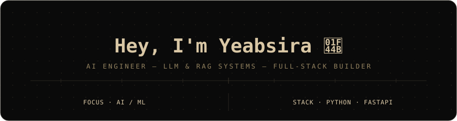

 

  

 

## `ABOUT`

 

I'm a Computer Science student at Addis Ababa University focused on Python and AI Engineering. I enjoy building practical projects, experimenting with AI, and learning by actually making things.

 

<table align="center">
<tr>
<th>💻 WHAT I'M INTO</th>
<th>🎨 INTERESTS</th>
</tr>
<tr>
<td valign="top">

- `🐍` Python
- `🤖` AI Engineering & LLM Applications
- `🧩` RAG, AI Agents & APIs
- `🧠` Data Structures & Algorithms
- `🛠️` Building AI-powered projects

</td>
<td valign="top">

- `♟️` Chess
- `📚` Philosophy & Literature
- `✏️` Pencil Art
- `🎹` Classical & Instrumental Music
- `🎌` Anime

</td>
</tr>
</table>

 

I enjoy works from Camus, Kafka, Dostoevsky, and Nietzsche, and I'm always looking for something interesting to learn or build.

 

## `GITHUB`

 

<!--
These cards are generated automatically by GitHub Actions.
The workflow updates: profile/stats.svg, profile/top-langs.svg
To fully match the black/gold theme, set these in the workflow's
generator config: background=000000, text/icon color=D4AF37
-->

  

  

  

  

<picture>
  <source media="(prefers-color-scheme: dark)" srcset="./github-contribution-grid-snake-dark.svg">
  <source media="(prefers-color-scheme: light)" srcset="./github-contribution-grid-snake.svg">
  
</picture>

  

 

## `METRICS`

 

 

## `TECHNOLOGY`

 

### `LANGUAGES`

  

### `FRAMEWORKS & LIBRARIES`

  

### `AI & DATA`

  

### `TOOLS & PLATFORMS`

 

## `AI ENGINEERING STACK`

 

  

  

 

## `CURRENTLY BUILDING`

 

  

 

## `CONTACT`

 

 <!-- TODO: swap href="#" for your LinkedIn URL -->
 <!-- TODO: swap in your real email -->
 <!-- TODO: swap href="#" for your portfolio URL -->

 

