<div align="center">

# `Y E A B S I R A`

### `AI ENGINEERING` · `COMPUTER SCIENCE` · `SOFTWARE`

<br>


<br><br>


</div>

<br>

<div align="center">

```text
╭──────────────────────────────────────────────────────────────╮
│                                                              │
│   YEABSIRA                                                    │
│                                                              │
│   COMPUTER SCIENCE      →      AI ENGINEERING                │
│                                                              │
│   BUILDING SYSTEMS      →      SOLVING PROBLEMS              │
│                                                              │
╰──────────────────────────────────────────────────────────────╯
```

</div>

---

<div align="center">

## `GITHUB`




<br><br>


</div>

---

<div align="center">

## `ACTIVITY`


</div>

---

<div align="center">

## `CONTRIBUTIONS`

<picture>
  <source media="(prefers-color-scheme: dark)" srcset="./github-contribution-grid-snake-dark.svg">
  <source media="(prefers-color-scheme: light)" srcset="./github-contribution-grid-snake.svg">
  
</picture>

</div>

---

<div align="center">

## `ACHIEVEMENTS`


</div>

---

<div align="center">

## `TECH STACK`

<br>


<br><br>


<br><br>


</div>

---

<div align="center">

## `AI`

`LLMs` · `RAG` · `EMBEDDINGS` · `AI AGENTS` · `TOOL CALLING`

<br>

## `ENGINEERING`

`BACKEND` · `APIs` · `DATABASES` · `SYSTEM DESIGN` · `DEPLOYMENT`

<br>

## `COMPUTING`

`DATA STRUCTURES` · `ALGORITHMS` · `COMPLEXITY` · `PROBLEM SOLVING`

</div>

---

<div align="center">

## `CRAM`

```text
                         ┌─────────────┐
                         │   DOCUMENT  │
                         └──────┬──────┘
                                ↓
                         ┌─────────────┐
                         │  INGESTION  │
                         └──────┬──────┘
                                ↓
                         ┌─────────────┐
                         │  CHUNKING   │
                         └──────┬──────┘
                                ↓
                         ┌─────────────┐
                         │ EMBEDDINGS  │
                         └──────┬──────┘
                                ↓
                         ┌─────────────┐
                         │VECTOR SEARCH│
                         └──────┬──────┘
                                ↓
                         ┌─────────────┐
                         │     LLM     │
                         └──────┬──────┘
                                ↓
                         ┌─────────────┐
                         │ EXAM ENGINE │
                         └─────────────┘
```

</div>

---

<div align="center">

## `CURRENT FOCUS`

```text
AI APPLICATIONS
       ↓
LLM INTEGRATION
       ↓
RAG
       ↓
BACKEND SYSTEMS
       ↓
ALGORITHMS
       ↓
SYSTEM DESIGN
```

</div>

---

<div align="center">

## `DEVELOPER ENVIRONMENT`


<br><br>

`PYTHON` · `VS CODE` · `GIT` · `GITHUB` · `LINUX` · `DOCKER`

</div>

---

<div align="center">

## `2026`

```text
          DSA
           │
           ▼
     ┌───────────┐
     │   BUILD   │
     └─────┬─────┘
           │
           ▼
     AI ENGINEERING
           │
           ▼
     ┌───────────┐
     │   SHIP    │
     └─────┬─────┘
           │
           ▼
      OPEN SOURCE
```

</div>

---

<div align="center">

## `SIGNAL`


</div>

<br>

<div align="center">

```text
BUILD  →  BREAK  →  DEBUG  →  UNDERSTAND  →  BUILD BETTER
```

</div>
