<div align="center">

# `YEABSIRA`

### `AI ENGINEERING` · `COMPUTER SCIENCE` · `SOFTWARE DEVELOPMENT`

<br>


<br><br>


</div>

<br>

<div align="center">

## `ABOUT`

<br>

Yeabsira is a Computer Science student at Addis Ababa University building at the intersection of AI engineering and human understanding. She writes Python, designs LLM pipelines, and builds RAG systems — but her mind lives in the space between Camus' absurdism and Kafka's labyrinthine logic, between Dostoevsky's psychological depth and Nietzsche's will to power. When she's not debugging models or studying data structures, she's playing chess, sketching in pencil, or losing herself in a Dostoevsky novel with a cup of coffee and a Bach cello suite playing in the background.

<br>

</div>

<br>

<div align="center">

## `HOBBIES & INTERESTS`

<br>

```text
$ cat ~/interests/hobbies

  chess
  philosophy & literature
  pencil art
  classical / instrumental
  anime
  reading

$ cat ~/interests/authors

  Camus
  Kafka
  Dostoevsky
  Nietzsche

$ echo "always building, always learning"
```

<br>

</div>

<br>

<div align="center">

## `GITHUB`

<br>

<!--
These cards are generated automatically by GitHub Actions.
The workflow updates:
profile/stats.svg
profile/top-langs.svg
-->

<p align="center">  </p>

<br><br>


<br><br>


<br><br>

<picture>
  <source media="(prefers-color-scheme: dark)" srcset="./github-contribution-grid-snake-dark.svg">
  <source media="(prefers-color-scheme: light)" srcset="./github-contribution-grid-snake.svg">
  
</picture>

<br><br>


</div>

<br>

<div align="center">

## `METRICS`

<br>


</div>

<br>

<div align="center">

## `TECHNOLOGY`

<br>

### `LANGUAGES`


<br><br>

### `FRAMEWORKS & LIBRARIES`


<br><br>

### `AI & DATA`


<br><br>

### `TOOLS & PLATFORMS`


</div>

<br>

<div align="center">

## `AI ENGINEERING`

<br>

```text
AI ENGINEERING STACK

  LLMs
  RAG
  Embeddings
  AI Agents
  Tool Calling
  Vector Search
  LLM Applications
  AI Systems
  API Integration
```

<br>

</div>

<br>

<div align="center">

## `CURRENTLY BUILDING`

<br>

<a href="https://github.com/yeabsiragebre/Cram">


</a>

<br><br>


</div>

<br>

<div align="center">

## `CONTACT`

<br>

```text
CONTACT

  LinkedIn  →  <!-- TODO: add LinkedIn handle -->
  Email     →  <!-- TODO: add email address -->
  Portfolio →  <!-- TODO: add portfolio URL -->
```

<br>

</div>

<br>

<div align="center">


</div>